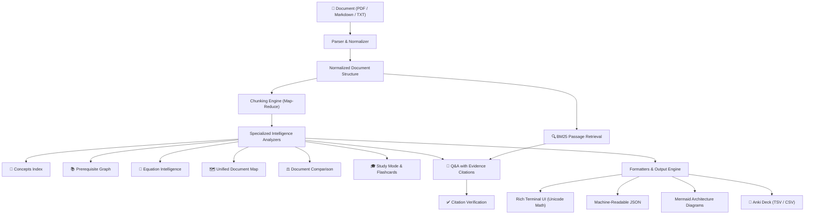

# DocPulse

<p align="center">
  
</p>

<p align="center">
  
  
  
</p>

`docpulse` is a fast, modern CLI tool for structured document intelligence, learning, and research. Rather than treating documents as unformatted text blobs or simply asking for free-form summaries, DocPulse decomposes documents into structured collections of **sections**, **concepts**, **prerequisites**, **equations**, **references**, and **grounded evidence** powered by LLMs through the **IBM ICA Gateway**.



---

## Features

### Understand
- **`docpulse analyze <doc>`** — Comprehensive document breakdown with executive summaries, core themes, prerequisite overview, and key implications.
- **`docpulse concepts <doc>`** — Extract a full structured concept index across the whole document with importance levels, section locations, and related concepts. Supports filtering via `--name <term>`.
- **`docpulse prerequisites <doc>`** — Dedicated prerequisite analysis identifying foundational knowledge, difficulty levels, target dependencies, and relevant document sections.
- **`docpulse equations <doc>`** — Identify and explain mathematical equations and formulas, parsing variables, operational definitions, and technical usage.

### Navigate
- **`docpulse section <doc> --id <sec>`** — Deep-dive focused analysis on a specific indexed section.
- **`docpulse sources <doc>`** — Identify external references, cited academic papers, GitHub repositories, datasets, and URLs.
- **`docpulse map <doc>`** — Synthesize a unified hierarchical document map connecting sections, concepts, prerequisites, equations, and references. Supports `--format mermaid` for visual diagrams.

### Learn
- **`docpulse study <doc>`** — Interactive study guide generator with key concepts, prerequisite review topics, active-recall flashcards, and self-assessment questions (conceptual, multiple-choice, short-answer).
- **`docpulse drill <doc>`** — Interactive flashcard drill with self-grading (hit / miss / skip) and a color-coded final score panel — the study loop closes, right in the terminal.
- **`docpulse anki <doc>`** — Export flashcards and quiz questions as an **Anki-importable deck** (TSV or CSV), with `--output <file>` for file output or piping straight to stdout.
- **`docpulse export <doc>`** — Export a complete study guide as a Markdown README or JSON file.

### Research
- **`docpulse ask <doc> ["question"] --citations`** — Multi-turn or one-shot question answering with grounded document citations (section, title, page, excerpt). Each citation is **verified locally**: a built-in BM25 retriever ranks relevant passages into the prompt, then checks every returned excerpt against the section it cites, flagging it `✓ verified` or `⚠ not verified`.
- **`docpulse compare <doc1> <doc2>`** — Structurally and conceptually compare two documents, identifying shared concepts, unique topics, methodology differences, and technical conclusions.

### Integrate & Maintain
- **Standardized JSON output** — All major commands support `--format json` for automation and pipeline integration.
- **Response caching** — Local content-addressed caching prevents redundant LLM calls. Pass `--no-cache` to force a fresh run.
- **`docpulse doctor`** — One-shot diagnostics: checks config, API key, cache, PDF parser, and gateway connectivity, with matching exit codes for scripts.
- **`docpulse cache`** — Inspect or wipe the local response cache.

---

## Installation

**Requirements:** Python 3.12+

```bash
# Install from source
pip install -e .

# Install with development dependencies (testing, linting)
pip install -e ".[dev]"
```

> **PDF support** is included by default via `pypdf`. No extra install is needed.

---

## Configuration

DocPulse connects to an **IBM ICA Gateway** endpoint. Run `docpulse init` once to configure it interactively, or set environment variables directly:

| Variable | Purpose |
|----------|---------|
| `DOCPULSE_ENDPOINT_URL` | IBM ICA Gateway base URL |
| `DOCPULSE_API_KEY` | Developer API key (optional for keyless gateways) |
| `DOCPULSE_NAMESPACE` | Gateway namespace (`chat-models`, `assistants`, `agents`, `digital-workforce`) |
| `DOCPULSE_MODEL_ID` | Model or assistant ID to use |
| `DOCPULSE_CACHE_DIR` | Override the default cache directory (`~/.docpulse/cache`) |
| `DOCPULSE_CONFIG_PATH` | Override the config file location (default `~/.docpulse/config.json`) |

Configuration is saved to `~/.docpulse/config.json`. Environment variables take precedence over the config file. Run `docpulse doctor` at any time to verify your setup.

The legacy aliases `ICA_ENDPOINT_URL`, `ICA_API_KEY`, `ICA_NAMESPACE`, and `ICA_MODEL_ID` are also accepted; each `DOCPULSE_*` variable takes precedence over its `ICA_*` counterpart.

---

## Quickstart & CLI Reference

### 1. Initialize Gateway Connection
```bash
docpulse init
```
Interactive setup — enter your endpoint, optional API key, namespace, and model ID. Verifies gateway connectivity before saving.

---

### 2. Understand Documents
```bash
# Full document analysis with executive summary
docpulse analyze paper.pdf

# Raw model response, printed as-is instead of the formatted Markdown panel
docpulse analyze paper.pdf --raw

# Structured concept index (sorted by importance)
docpulse concepts paper.pdf
docpulse concepts paper.pdf --name "attention"
docpulse concepts paper.pdf --format json

# Prerequisite analysis — difficulty levels, dependencies, relevant sections
docpulse prerequisites paper.pdf
docpulse prerequisites paper.pdf --format json

# Mathematical equations with variable index and explanations
docpulse equations paper.pdf
docpulse equations paper.pdf --format json
```

---

### 3. Navigate & Map
```bash
# Focused in-depth analysis of a specific section
docpulse section paper.pdf --id 2

# Extract external references, papers, repos, and URLs
docpulse sources guide.md

# Unified document map (tree view, JSON, or Mermaid diagram)
docpulse map paper.pdf
docpulse map paper.pdf --format json
docpulse map paper.pdf --format mermaid
```

---

### 4. Learn & Study
```bash
# Study guide with key concepts, flashcards, and quiz questions
docpulse study paper.pdf --questions 5
docpulse study paper.pdf --format json

# Interactive flashcard drill with self-grading and score summary
docpulse drill paper.pdf
docpulse drill paper.pdf --questions 10

# Export a complete study guide as Markdown
docpulse export paper.pdf --format md --output study_notes.md

# Export an Anki-importable flashcard deck (TSV or CSV)
docpulse anki paper.pdf
docpulse anki paper.pdf --format csv --output deck.csv
docpulse anki paper.pdf --no-questions          # flashcards only, piped to stdout
```

---

### 5. Research & Evidence
```bash
# One-shot question with grounded, locally-verified citations
docpulse ask paper.pdf "Why is the attention score scaled?" --citations

# Restrict Q&A to a single section
docpulse ask paper.pdf "What does this section claim?" --id 3

# Interactive multi-turn Q&A session (omit the question argument)
docpulse ask paper.pdf

# Compare two documents structurally and conceptually
docpulse compare attention_paper.pdf rnn_paper.pdf
docpulse compare attention_paper.pdf rnn_paper.pdf --format json
```

---

### 6. Maintain
```bash
# Diagnose config, cache, PDF parser, and gateway connectivity
docpulse doctor
docpulse doctor --no-network        # skip the network probe
docpulse doctor --format json       # machine-readable health report

# Inspect or clear the local response cache
docpulse cache
docpulse cache --clear
docpulse cache --format json
```

---

## Global Flags

```bash
# Print the installed version and exit (also `-v`)
docpulse --version

# Print full tracebacks for unexpected errors
docpulse --debug analyze paper.pdf

# Read an unsupported file type (e.g. .rst, .html) as plain text
docpulse --force-text analyze notes.rst
```

These flags go **before** the subcommand name.

> `--force-text` is an escape hatch, not a converter. It reads raw bytes as UTF-8 text, so it is not a substitute for OCR on scanned PDFs or HTML rendering.

---

## Exit Codes

DocPulse distinguishes failure kinds so scripts can react programmatically instead of parsing prose.

| Code | Meaning | Examples |
|------|---------|----------|
| `0` | Success (warnings are non-fatal) | |
| `1` | Unexpected internal error | unhandled exception; use `--debug` for traceback |
| `2` | Configuration or usage problem | missing `endpoint_url`, invalid flag, unsupported `--format` |
| `3` | Gateway or network problem | timeouts, HTTP errors after retries, connection refused |
| `4` | Document problem | file missing, unsupported type, no extractable text, unknown section ID |
| `5` | Model returned nothing usable | valid response but no result could be extracted |

```bash
docpulse analyze missing.pdf --format json   # → {"error": ..., "hint": ...}
echo $?                                      # → 4
```

**Notes:**
- An **API key is optional.** Keyless gateways work fine; a missing key only prints a note, never changes the exit code.
- Warnings never change the exit code. A truncated or unparseable response still exits `0` but reports so in `warnings`; with `--format json` warnings are part of the payload.
- `docpulse doctor` mirrors these codes so scripts can react to a failed health check (exit `2` for configuration, exit `3` for gateway).
- JSON output is written raw to stdout — never wrapped or truncated for terminal width — so it stays pipe-safe for `jq` and other tools. Output is always UTF-8.

---

## Transport Tuning

| Variable | Default | Purpose |
|----------|---------|---------|
| `DOCPULSE_TIMEOUT` | `120` | Per-request timeout in seconds |
| `DOCPULSE_MAX_RETRIES` | `3` | Total attempts for retryable failures |
| `DOCPULSE_RETRY_BACKOFF` | `0.8` | Base seconds for exponential backoff with jitter |

Retryable failures: connection errors, timeouts, HTTP `429`, and HTTP `5xx`. A server-provided `Retry-After` header overrides the computed backoff. Invalid values fall back to defaults silently.

---

## Large Documents

DocPulse is designed to analyze **whole documents**, not just the first ~16 000 characters.

- Documents under ~16 000 characters are analyzed directly.
- Larger documents are split into overlapping semantic chunks, condensed via LLM map-reduce summarization, and merged into a unified context covering the entire document.
- Safety cap: up to 20 chunks (~240 000 characters) are processed, with an explicit warning if content is truncated rather than a silent cutoff.

---

## Grounded Citations with Local Verification

`docpulse ask --citations` answers from the document itself, not from model memory. The retrieval pipeline is **100% local** and dependency-free — a hand-rolled BM25 index over the document's sections (k1 = 1.5, b = 0.75):

1. Passages are built from the document sections (≈1 200-char chunks, 200-char overlap) and indexed with BM25.
2. Your question retrieves the top matches; those passages are injected into the prompt as grounding context.
3. The model answers with citations; each citation is checked by `verify_evidence()`, which confirms the excerpt appears in the cited section and scores how strongly that section matches the question.

Every citation is labelled `✓ verified` or `⚠ not verified` in the output. With `--format json` each citation carries `verified: bool` and `score: float`:

```json
{
  "answer": "Attention is scaled to keep dot-product magnitudes stable.",
  "evidence": [
    {
      "section": 2,
      "section_title": "Background",
      "page": 3,
      "excerpt": "we scale the dot products by 1/√dk...",
      "verified": true,
      "score": 0.87
    }
  ]
}
```

---

## Response Caching

Every LLM request is hashed and cached locally under `~/.docpulse/cache` (override with `DOCPULSE_CACHE_DIR`). Re-running commands on unchanged documents is instant.

```bash
docpulse analyze paper.pdf --no-cache   # force a fresh LLM call
docpulse cache                          # show cache path, entry count, and total size
docpulse cache --clear                  # wipe all cached responses
docpulse cache --format json            # machine-readable cache report
```

---

## Architecture

DocPulse follows clean architectural separation:

| Module | Responsibility |
|--------|---------------|
| `docpulse.models` | Typed Pydantic schemas for documents, concepts, prerequisites, equations, comparisons, and study guides |
| `docpulse.parsers` | Modular parsers for PDF, Markdown, and TXT files; normalizes all formats into a unified document structure |
| `docpulse.analyzers` | Parses, validates, and structures raw LLM output into typed domain objects |
| `docpulse.renderers` | Rich terminal UI (colored panels, Unicode math), JSON serialization, and Mermaid diagram generation |
| `docpulse.retrieval` | Dependency-free BM25 passage retrieval and citation verification for `ask --citations` |
| `docpulse.mathbox` | Extracts and prettifies inline/display math into Unicode for readable terminal output |
| `docpulse.longdoc` | Chunked map-reduce preparation for large documents, with explicit truncation feedback |
| `docpulse.llm` & `docpulse.cache` | IBM ICA Gateway client with retry logic, response caching, and health verification |
| `docpulse.errors` | Typed exception hierarchy mapping each failure kind to a documented exit code with recovery hints |
| `docpulse.config` | Validated configuration with redacted key display and transport defaults |

---

## Contributing & Development

```bash
# Clone and install with dev dependencies
git clone <repo-url>
cd DocPulse-AI
pip install -e ".[dev]"

# Run the test suite
pytest

# Run the linter
ruff check src/ tests/

# Auto-fix lint issues
ruff check --fix src/ tests/
```

Tests live in `tests/` and cover CLI commands, renderers, parsers, caching, retrieval, and LLM response parsing. All tests use mocked LLM clients — no real gateway connection is required.

---

## License

MIT — see [LICENSE](LICENSE) for details.
