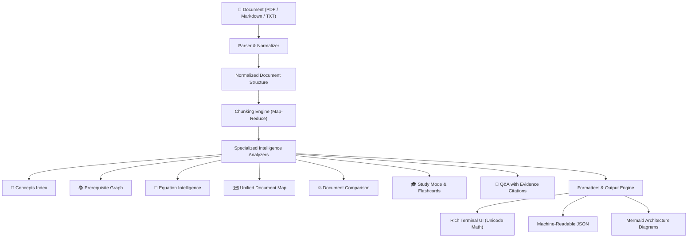

# DocPulse

`docpulse` is a fast, modern CLI tool for structured document intelligence, learning, and research. Rather than treating documents as unformatted text blobs or simply asking for free-form summaries, DocPulse decomposes documents into structured collections of **sections**, **concepts**, **prerequisites**, **equations**, **references**, and **grounded evidence** powered by LLMs through the **IBM ICA Gateway**.



---

## Features

### Understand
- **`docpulse analyze <doc>`**: Comprehensive document breakdown with executive summaries, core themes, prerequisite overview, and key implications.
- **`docpulse concepts <doc>`**: Extract a full structured concept index across the whole document with importance levels, section locations, and related concepts. Supports filtering via `--name <term>`.
- **`docpulse prerequisites <doc>`**: Dedicated prerequisite analysis identifying foundational knowledge, difficulty levels, target dependencies, and relevant document sections.
- **`docpulse equations <doc>`**: Identify and explain mathematical equations and formulas, parsing variables, operational definitions, and technical usage.

### Navigate
- **`docpulse section <doc> --id <sec>`**: Deep-dive focused analysis on a specific indexed section.
- **`docpulse sources <doc>`**: Identify external references, cited academic papers, GitHub repositories, datasets, and URLs.
- **`docpulse map <doc>`**: Synthesize a unified hierarchical document map connecting sections, concepts, prerequisites, equations, and references. Supports `--format mermaid` for visual diagrams.

### Learn
- **`docpulse study <doc>`**: Interactive study guide generator with key concepts, prerequisite review topics, active-recall flashcards, and self-assessment test questions (conceptual, multiple-choice, short-answer).
- **`docpulse export <doc> --format md`**: Export a complete study guide and README notes in Markdown or JSON.

### Research
- **`docpulse ask <doc> ["question"] --citations`**: Multi-turn or one-shot question answering with grounded document citations (section number, title, page, and excerpt).
- **`docpulse compare <doc1> <doc2>`**: Structurally and conceptually compare two documents, identifying shared concepts, unique topics, methodology differences, and technical conclusions.

### Integrate & Performance
- **Standardized JSON Output**: All major commands support `--format json` for automation, pipeline integration, and scripting.
- **Response Caching**: Local content-addressed caching prevents redundant LLM calls. Pass `--no-cache` to force fresh runs.

---

## Installation

```bash
pip install -e .
```

---

## Quickstart & CLI Reference

### 1. Initialize Gateway Setup
```bash
docpulse init
```

### 2. Understand Documents
```bash
# Full document analysis
docpulse analyze paper.pdf

# Structured concept index
docpulse concepts paper.pdf
docpulse concepts paper.pdf --name "attention"
docpulse concepts paper.pdf --format json

# Prerequisite analysis & dependencies
docpulse prerequisites paper.pdf
docpulse prerequisites paper.pdf --format json

# Mathematical equations & variable index
docpulse equations paper.pdf
docpulse equations paper.pdf --format json
```

### 3. Navigate & Map
```bash
# Focused section analysis
docpulse section paper.pdf --id 2

# External references and citations
docpulse sources guide.md

# Unified document map
docpulse map paper.pdf
docpulse map paper.pdf --format json
docpulse map paper.pdf --format mermaid
```

### 4. Learn & Study
```bash
# Interactive study mode with flashcards and quiz questions
docpulse study paper.pdf --questions 5
docpulse study paper.pdf --format json

# Export comprehensive study guide
docpulse export paper.pdf --format md --output study_notes.md
```

### 5. Research & Evidence
```bash
# Ask questions with grounded evidence
docpulse ask paper.pdf "Why is the attention score scaled?" --citations

# Compare two documents
docpulse compare attention_paper.pdf rnn_paper.pdf
docpulse compare attention_paper.pdf rnn_paper.pdf --format json
```

---

## Global Flags

```bash
# Print full tracebacks for unexpected errors
docpulse --debug analyze paper.pdf

# Read an unsupported file type as plain text
docpulse --force-text analyze notes.rst
```

Both are root options, so they go **before** the subcommand.

`--force-text` is an escape hatch, not a converter. It reads raw bytes as text, so it is
not a substitute for OCR on a scanned PDF.

---

## Exit Codes

DocPulse distinguishes failure kinds so scripts can react instead of parsing prose.

| Code | Meaning | Examples |
|------|---------|----------|
| `0` | Success (may still include warnings) | |
| `1` | Unexpected internal error | unhandled exception, `--debug` for the traceback |
| `2` | Configuration or usage problem | missing `endpoint_url`, invalid flag, unsupported `--format` |
| `3` | Gateway or network problem | timeouts, HTTP errors after retries, connection refused |
| `4` | Document problem | file missing, unsupported type, no extractable text, unknown section id |
| `5` | Model returned nothing usable | valid response but no result could be extracted |

```bash
docpulse analyze missing.pdf --format json   # -> {"error": ..., "hint": ...}
echo $?                                     # -> 4
```

Notes:
- An **API key is optional.** Keyless gateways work fine; a missing key only prints a note.
- Warnings never change the exit code. A truncated or unparseable response still exits `0`
  but says so in `warnings`, and with `--format json` the warnings are part of the payload.
- JSON output is written raw to stdout: it is never wrapped or truncated for terminal width,
  so it stays pipe-safe for `jq` and scripts. Unicode is emitted as UTF-8.

---

## Transport Tuning

| Variable | Default | Purpose |
|----------|---------|---------|
| `DOCPULSE_TIMEOUT` | `120` | Per-request timeout in seconds |
| `DOCPULSE_MAX_RETRIES` | `3` | Total attempts for retryable failures |
| `DOCPULSE_RETRY_BACKOFF` | `0.8` | Base seconds for exponential backoff with jitter |

Retryable failures are connection errors, timeouts, HTTP `429`, and HTTP `5xx`. A
server-provided `Retry-After` header overrides the computed backoff. Unparseable values
in these variables fall back to the defaults rather than breaking every command.

---

## Large Documents

DocPulse is designed to analyze **whole documents**, not just the first ~16,000 characters. 
- Documents under ~16,000 characters are analyzed directly.
- Larger documents are split into overlapping semantic chunks, condensed via LLM map-reduce summarization, and merged into a unified context covering the entire document.
- Safety cap: Up to 20 chunks (~240,000 characters) are supported with explicit warnings if content exceeds the ceiling.

---

## Response Caching

Every LLM request is hashed and cached locally under `~/.docpulse/cache` (override with `DOCPULSE_CACHE_DIR`). Re-running commands on unchanged documents is instant and incurs zero LLM overhead.
Bypass cache anytime using:
```bash
docpulse analyze paper.pdf --no-cache
```

---

## Architecture

DocPulse follows clean architectural separation:
- **`docpulse.models`**: Typed Pydantic data schemas and domain models for document structures, concepts, prerequisites, equations, comparisons, and study guides.
- **`docpulse.parsers`**: Modular parsers normalizing PDF, Markdown, TXT, and plain-text files into unified document structures, with an explicit allowlist and `--force-text` override.
- **`docpulse.analyzers`**: Dedicated intelligence modules for parsing, validating, and structuring LLM outputs.
- **`docpulse.renderers`**: Terminal presentation using Rich (with equation box rendering), JSON serialization, and Mermaid syntax generators.
- **`docpulse.mathbox`**: Extracts and prettifies inline/display math into Unicode so equations stay readable in a plain terminal.
- **`docpulse.longdoc`**: Chunked map-reduce preparation for documents too large to analyze directly, with explicit chunking/truncation feedback instead of a silent cutoff.
- **`docpulse.llm` & `docpulse.cache`**: IBM ICA Gateway client with automated caching and health verification.
- **`docpulse.errors`**: Typed exception hierarchy that maps each failure kind to a documented exit code, each carrying its own recovery hint.
- **`docpulse.config`**: Validated configuration with redacted key display and transport defaults.
